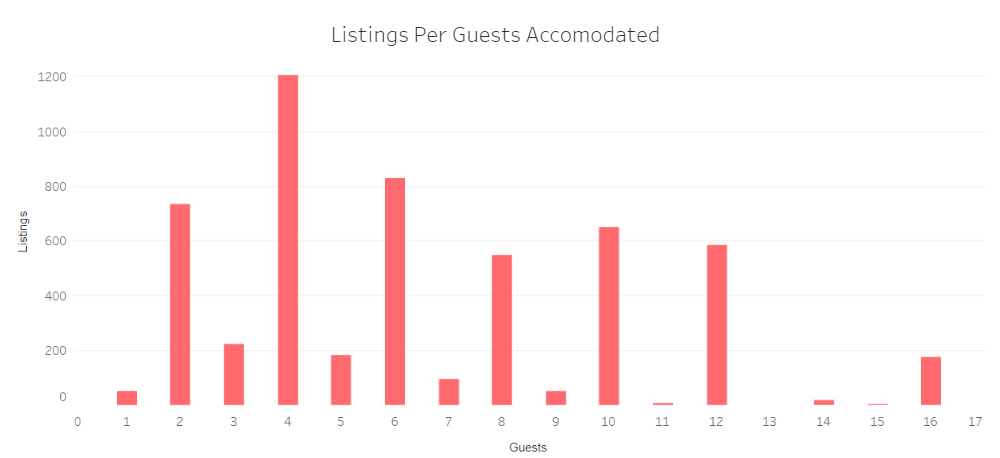
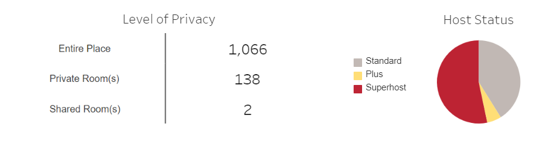
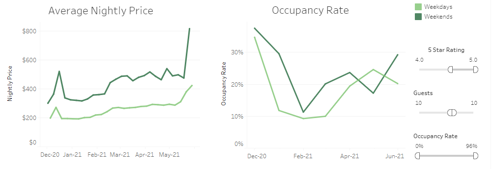
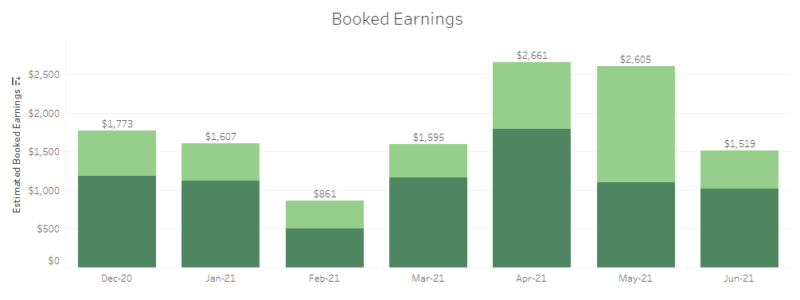
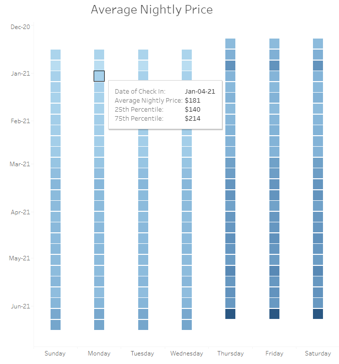

# AnalyzeBNB
### A Market Analysis and Pricing Tool for Airbnb Hosts. Check out my finished presentation on Tableau Public [here](https://public.tableau.com/profile/sarah.beth.ivester#!/vizhome/analyzebnb/analyzebnb).

## Description
#### This tool allows hosts to retrieve custom insights on similar listings in the Nashville, TN area. Webscraped data directly from Airbnb's site empowers hosts to better understand the market they operate in and how to appropriately value their listing.  

## Motivation
#### This tool can be used to analyze the short term rental competition in your area before investing in a property or investigate pricing strategies of competitors to optimize your revenue stream.

## Data Collection
#### Since Airbnb does not provide a data set for investigating pricing strategies, occupancy rates, and potential earnings of other listings, I employed a process known as web scraping to extract data from Airbnb's site to create my own structured data set. Web scraping is the process of collecting and parsing raw data from the Web. I extracted data from the list of search results on Airbnb's site. The data includes information about all listings in Nashville, TN with availability in the next six months (Dec-20 - Jun-21). The following data fields were extracted:

- Listing Name
- Host Status
- Listing URL
- Property Type
- Guests Accommodated
- Star Rating
- Number of Reviews
- Nightly Price
- Additional Fees

## Insights

#### 1 ) Expansion
##### Hosts looking to expand in the short term rental market are able to view the characteristics of listings based on the number of guests accommodated to evaluate an investment decision.

##### From this bar chart, hosts are able to select a number of guests to view characteristics of these specific listings and their hosts. Hosts will be able to answer: What level of privacy do similar properties provide? What level of status have hosts of similar properties achieved?

#### 2 ) Performance
###### Current hosts will be able to view similar properties nightly price and how often they are booked. The line charts below show six months of data for average nightly price and occupancy rate. The filters on the right side of the image have been used to look at listings with a 4.0 star rating or higher and host 10 guests.

###### Nightly price and occupancy rate can be used to determine an estimated booked earnings similar properties are generating. The bar chart below shows the earnings produced from the average property with 4.0+ stars and 10 guests for the next six months.

#### 3 ) Pricing Strategy
###### The pricing calendar gives hosts detailed pricing information for upcoming weekdays and weekends for the next six months. By hovering over specific dates hosts can view the average price for that night along with the 25th and 75th percentiles.

## Technologies
#### I developed this tool with the following technologies:

- Python 3.8.3
  - Beatiful Soup
- Jupyter Notebook
- Tableau
- Excel
